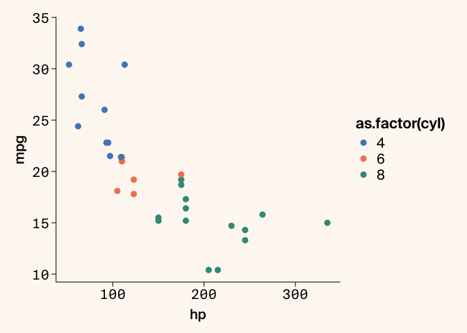
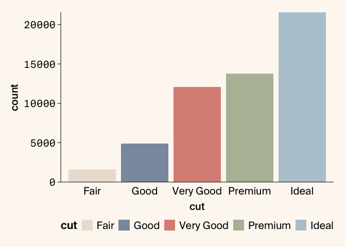
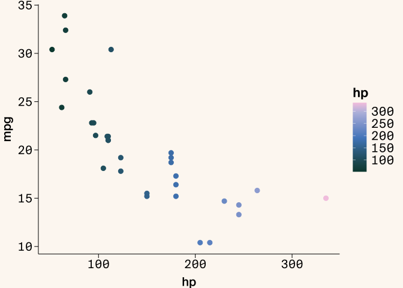
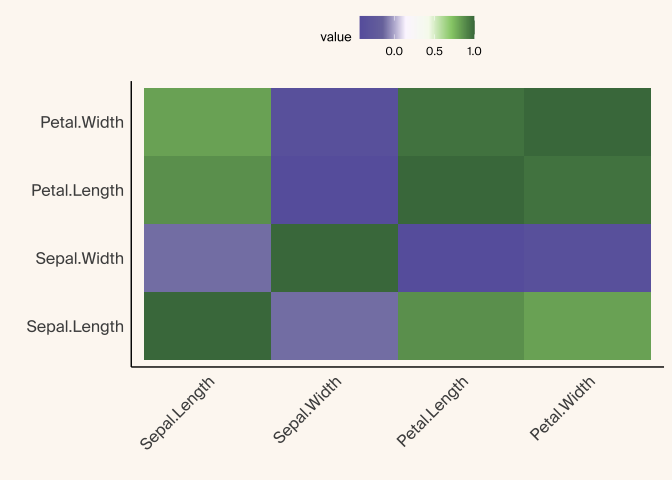

# arcadiathemeR

The goal of the arcadiathemeR package is to create ggplot2-style plots
in R that (mostly) adhere to Arcadia Science style guidelines.

## Installation

You can install arcadiathemeR from Github using the `remotes` package.
If you do not have this package installed you will need to do so before
installing the `arcadiathemeR` package.

``` r
# install.packages("remotes")
remotes::install_github("Arcadia-Science/arcadiathemeR")
```

## Usage

See the full vignette (TBD)

To access the functions in the arcadiathemeR package, load with:

``` r
library(arcadiathemeR)
```

The arcadiathemeR package is modeled after the [`ggthemes`
package](https://github.com/jrnold/ggthemes), layering on the plot theme
and color palettes in the same fashion as the `ggthemes` package.

``` r
library(ggplot2)
library(arcadiathemeR)
#> Loading Suisse fonts...
#> All custom fonts 'Suisse Int'l, Suisse Int'l Semi Bold, Suisse Int'l Medium' are successfully loaded.

ggplot(data=mtcars, aes(x=hp, y=mpg, color=as.factor(cyl))) +
  geom_point(size=2.5) +
  theme_arcadia(x_axis_type = "numerical") +
  scale_color_arcadia(palette_name = "primary")
```

<!-- -->

By default the `theme_arcadia()` function assumes that both axes are
numerical data. Since we have different font and plot styles for
categorical data, you can specify if the axis is categorical with:

``` r
ggplot(data=diamonds, aes(x=cut, fill=cut)) +
  geom_bar() +
  theme_arcadia(x_axis_type = "categorical") +
  scale_fill_arcadia(palette_name = "secondary", reverse = TRUE) +
  scale_y_continuous(expand=c(0,0)) + # removes whitespace between axis and bars
  theme(legend.position = "bottom")
```

<!-- -->

You can also select different indices of colors from the palettes within
the `scale` function:

``` r
ggplot(mtcars, aes(x = hp, fill = as.factor(cyl))) +
  geom_density(alpha = 0.8, linewidth = 0) + # remove border line from filled-in density plots
  theme_arcadia() +
  scale_fill_arcadia(palette_name = "blue_shades", start=2, end=5) +
  scale_y_continuous(expand=c(0,0)) +
  scale_x_continuous(expand=c(0,0)) # remove whitespace between both axes and the plot
```

<!-- -->

You can also apply gradient palettes to your plots with
`gradient_fill_arcadia` or `gradient_scale_arcadia` in a similar fashion
to the above:

``` r
ggplot(data = mtcars, aes(x = hp, y = mpg, color = hp)) +
 geom_point(size=2.5) + 
 theme_arcadia() + 
 gradient_color_arcadia(palette_name = "lisafrank")
```

<!-- -->

There are also bicolor gradients available that are useful for heatmap
plots, and you can also remove the background color with
`background = FALSE` in the `theme_arcadia()` function:

``` r
library(reshape2)

# heatmap of correlation matrix from iris dataset
data(iris)
iris_data <- iris[, 1:4]
cor_matrix <- cor(iris_data)
melted_cor_matrix <- (melt(cor_matrix))

ggplot(melted_cor_matrix, aes(x=Var1, y=Var2, fill=value)) +
  geom_tile() +
  theme_arcadia(x_axis_type = "categorical", y_axis_type = "categorical", background = FALSE) +
  gradient_fill_arcadia(palette_name = "reds") + 
  theme(axis.text.x = element_text(angle = 45, hjust = 1),
        legend.position = "top") +
  labs(x = "", y = "")
```

<!-- -->

You can view all the color palette options and the individual hex codes
composing each palette within the main and gradient palettes with:

``` r
show_arcadia_palettes()
#> $primary
#>  [1] "#5088C5" "#F28360" "#3B9886" "#F7B846" "#7A77AB" "#F898AE" "#73B5E3"
#>  [8] "#FFB984" "#F5E4BE" "#BABEE0" "#97CD78" "#C85152"
#> 
#> $secondary
#> [1] "#C6E7F4" "#F8C5C1" "#DBD1C3" "#B6C8D4" "#B5BEA4" "#DA9085" "#8A99AD"
#> [8] "#EDE0D6"
#> 
#> $primary_ordered
#>  [1] "#5088C5" "#F28360" "#F7B846" "#97CD78" "#7A77AB" "#F898AE" "#3B9886"
#>  [8] "#C85152" "#73B5E3" "#FFB984" "#F5E4BE" "#BABEE0"
#> 
#> $secondary_ordered
#> [1] "#C6E7F4" "#F8C5C1" "#DBD1C3" "#B5BEA4" "#B6C8D4" "#DA9085" "#EDE0D6"
#> [8] "#8A99AD"
#> 
#> $neutrals
#> [1] "#FFFFFF" "#EBEDE8" "#BAB0A8" "#8F8885" "#43413F" "#484B50" "#292928"
#> [8] "#09090A" "#596F74"
#> 
#> $blue_shades
#> [1] "#C6E7F4" "#73B5E3" "#5088C5" "#2B65A1" "#094468"
#> 
#> $orange_shades
#> [1] "#FFCFAF" "#FFB984" "#F28360" "#C85152" "#9E3F41"
#> 
#> $yellow_shades
#> [1] "#F5E4BE" "#FFD364" "#F7B846" "#D68D22" "#A85E28"
#> 
#> $purple_shades
#> [1] "#DCDFEF" "#BABEE0" "#7A77AB" "#54448C" "#341E60"
#> 
#> $teal_shades
#> [1] "#C3E2DB" "#6FBCAD" "#3B9886" "#2A6B5E" "#09473E"
#> 
#> $pink_shades
#> [1] "#FFE3D4" "#F8C5C1" "#F898AE" "#E2718F" "#C04C70"
#> 
#> $warm_gray_shades
#> [1] "#EDE6DA" "#DBD1C3" "#BAB0A8" "#8F8885" "#635C5A"
#> 
#> $cool_gray_shades
#> [1] "#E6EAED" "#CAD4DB" "#ABBAC4" "#8A99AD" "#687787"
show_arcadia_gradients()
#> $magma
#> $magma$colors
#> [1] "#341E60" "#54448C" "#A96789" "#E9A482" "#F5DFB2"
#> 
#> $magma$positions
#> [1] 0.000 0.217 0.498 0.799 1.000
#> 
#> 
#> $verde
#> $verde$colors
#> [1] "#09473E" "#4E7F72" "#FFCC7B" "#FFE3D4"
#> 
#> $verde$positions
#> [1] 0.000 0.357 0.909 1.000
#> 
#> 
#> $viridis
#> $viridis$colors
#> [1] "#282A49" "#5088C5" "#97CD78" "#FFFDBD"
#> 
#> $viridis$positions
#> [1] 0.000 0.468 0.746 1.000
#> 
#> 
#> $wine
#> $wine$colors
#> [1] "#52180A" "#C85152" "#FFB984" "#F8F4F1"
#> 
#> $wine$positions
#> [1] 0.000 0.451 0.828 1.000
#> 
#> 
#> $lisafrank
#> $lisafrank$colors
#> [1] "#09473E" "#5088C5" "#BABEE0" "#F4CAE3"
#> 
#> $lisafrank$positions
#> [1] 0.000 0.484 0.862 1.000
#> 
#> 
#> $sunset
#> $sunset$colors
#> [1] "#4D2500" "#A85E28" "#E9A482" "#FFCC7B" "#FFE3D4"
#> 
#> $sunset$positions
#> [1] 0.000 0.407 0.767 0.915 1.000
#> 
#> 
#> $oranges
#> $oranges$colors
#> [1] "#964222" "#FFB984" "#F8F4F1"
#> 
#> $oranges$positions
#> [1] 0.000 0.761 1.000
#> 
#> 
#> $sages
#> $sages$colors
#> [1] "#2A6B5E" "#B5BEA4" "#F7FBEF"
#> 
#> $sages$positions
#> [1] 0.000 0.641 1.000
#> 
#> 
#> $orangesage
#> $orangesage$colors
#> [1] "#964222" "#FFB984" "#F8F4F1" "#F7FBEF" "#B5BEA4" "#2A6B5E"
#> 
#> $orangesage$positions
#> [1] 0.000 0.761 1.000 1.000 0.641 0.000
#> 
#> 
#> $reds
#> $reds$colors
#> [1] "#9E3F41" "#C85152" "#FFF3F4"
#> 
#> $reds$positions
#> [1] 0.000 0.212 1.000
#> 
#> 
#> $blues
#> $blues$colors
#> [1] "#2B65A1" "#5088C5" "#F4FBFF"
#> 
#> $blues$positions
#> [1] 0.000 0.254 1.000
#> 
#> 
#> $redblue
#> $redblue$colors
#> [1] "#9E3F41" "#C85152" "#FFF3F4" "#F4FBFF" "#5088C5" "#2B65A1"
#> 
#> $redblue$positions
#> [1] 0.000 0.212 1.000 1.000 0.254 0.000
#> 
#> 
#> $purples
#> $purples$colors
#> [1] "#6862AB" "#7A77AB" "#FCF7FF"
#> 
#> $purples$positions
#> [1] 0.000 0.144 1.000
#> 
#> 
#> $greens
#> $greens$colors
#> [1] "#47784A" "#97CD78" "#F7FBEF"
#> 
#> $greens$positions
#> [1] 0.000 0.622 1.000
#> 
#> 
#> $purplegreen
#> $purplegreen$colors
#> [1] "#6862AB" "#7A77AB" "#FCF7FF" "#F7FBEF" "#97CD78" "#47784A"
#> 
#> $purplegreen$positions
#> [1] 0.000 0.144 1.000 1.000 0.622 0.000
```

## Development

To install the package locally from a specific branch while in
development, do the following:

``` r
# TODO change to main once deployed
remotes::install_github("Arcadia-Science/arcadiathemeR", \
ref="EAM/font-fixes"
```
