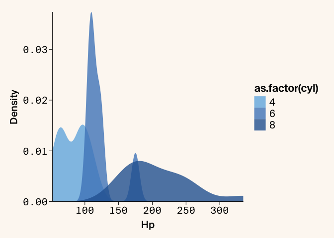

# arcadiathemeR

The goal of the arcadiathemeR package is to create ggplot2-style plots
in R that (mostly) adhere to Arcadia Science style guidelines.

## Installation

You can install arcadiathemeR from Github using the `remotes` package.
If you do not have this package installed you will need to do so before
installing the `arcadiathemeR` package.

``` r
# install.packages("remotes")
remotes::install_github("Arcadia-Science/arcadiathemeR")
```

## Usage

See the full vignette (TBD)

To access the functions in the arcadiathemeR package, load with:

``` r
library(arcadiathemeR)
```

The arcadiathemeR package is modeled after the [`ggthemes`
package](https://github.com/jrnold/ggthemes), layering on the plot theme
and color palettes in the same fashion as the `ggthemes` package.

``` r
library(ggplot2)
library(arcadiathemeR)

ggplot(data=mtcars, aes(x=hp, y=mpg, color=as.factor(cyl))) +
  geom_point(size=2.5) +
  theme_arcadia(x_axis_type = "numerical") +
  scale_color_arcadia("primary")
```

<!-- -->

By default the `theme_arcadia()` function assumes that both axes are
numerical data. Since we have different font and plot styles for
categorical data, you can specify if the axis is categorical with:

``` r
ggplot(data=diamonds, aes(x=cut, fill=cut)) +
  geom_bar() +
  theme_arcadia(x_axis_type = "categorical") +
  scale_fill_arcadia("secondary", reverse = TRUE) +
  scale_y_continuous(expand=c(0,0)) # removes whitespace between axis and bars
```

<!-- -->

You can also select different indices of colors from the palettes within
the `scale` function:

``` r
ggplot(mtcars, aes(x = hp, fill = as.factor(cyl))) +
  geom_density(alpha = 0.8, color = NA) + # remove border line from filled-in density plots
  theme_arcadia() +
  scale_fill_arcadia("blue_shades", start=2, end=5) +
  scale_y_continuous(expand=c(0,0)) +
  scale_x_continuous(expand=c(0,0)) # remove whitespace between both axes and the plot
```

<!-- -->

You can also apply gradient palettes to your plots with
`gradient_fill_arcadia` or `gradient_scale_arcadia` in a similar fashion
to the above:

``` r
ggplot(data = mtcars, aes(x = hp, y = mpg, color = hp)) +
 geom_point(size=2.5) + 
 theme_arcadia() + 
 gradient_color_arcadia("lisafrank")
```

<!-- --> You can view all
the color palette options and the individual hex codes composing each
palette within the main and gradient palettes with:

``` r
show_arcadia_palettes()
#> $primary
#>  [1] "#5088C5" "#F28360" "#3B9886" "#F7B846" "#7A77AB" "#F898AE" "#73B5E3"
#>  [8] "#FFB984" "#F5E4BE" "#BABEE0" "#97CD78" "#C85152"
#> 
#> $secondary
#> [1] "#C6E7F4" "#F8C5C1" "#DBD1C3" "#B6C8D4" "#B5BEA4" "#DA9085" "#8A99AD"
#> [8] "#EDE0D6"
#> 
#> $primary_ordered
#>  [1] "#5088C5" "#F28360" "#F7B846" "#97CD78" "#7A77AB" "#F898AE" "#3B9886"
#>  [8] "#C85152" "#73B5E3" "#FFB984" "#F5E4BE" "#BABEE0"
#> 
#> $secondary_ordered
#> [1] "#C6E7F4" "#F8C5C1" "#DBD1C3" "#B5BEA4" "#B6C8D4" "#DA9085" "#EDE0D6"
#> [8] "#8A99AD"
#> 
#> $neutrals
#> [1] "#FFFFFF" "#EBEDE8" "#BAB0A8" "#8F8885" "#43413F" "#484B50" "#292928"
#> [8] "#09090A" "#596F74"
#> 
#> $blue_shades
#> [1] "#C6E7F4" "#73B5E3" "#5088C5" "#2B65A1" "#094468"
#> 
#> $orange_shades
#> [1] "#FFCFAF" "#FFB984" "#F28360" "#C85152" "#9E3F41"
#> 
#> $yellow_shades
#> [1] "#F5E4BE" "#FFD364" "#F7B846" "#D68D22" "#A85E28"
#> 
#> $purple_shades
#> [1] "#DCDFEF" "#BABEE0" "#7A77AB" "#54448C" "#341E60"
#> 
#> $green_shades
#> [1] "#C3E2DB" "#6FBCAD" "#3B9886" "#2A6B5E" "#09473E"
#> 
#> $pink_shades
#> [1] "#FFE3D4" "#F8C5C1" "#F898AE" "#E2718F" "#C04C70"
#> 
#> $warm_gray_shades
#> [1] "#EDE6DA" "#DBD1C3" "#BAB0A8" "#8F8885" "#635C5A"
#> 
#> $cool_gray_shades
#> [1] "#E6EAED" "#CAD4DB" "#ABBAC4" "#8A99AD" "#687787"
show_arcadia_gradients()
#> $magma
#> [1] "#341E60" "#54448C" "#A96789" "#E9A482" "#F5DFB2"
#> 
#> $verde
#> [1] "#09473E" "#4E7F72" "#FFCC7B" "#FFE3D4"
#> 
#> $viridis
#> [1] "#282A49" "#5088C5" "#97CD78" "#FFFDBD"
#> 
#> $wine
#> [1] "#52180A" "#C85152" "#FFB984" "#FFE3D4"
#> 
#> $lisafrank
#> [1] "#09473E" "#5088C5" "#BABEE0" "#F4CAE3"
#> 
#> $sunset
#> [1] "#4D2500" "#A85E28" "#E9A482" "#FFCC7B" "#F5DFB2"
#> 
#> $oranges
#> [1] "#964222" "#FFB984" "#F8F4F1"
#> 
#> $sages
#> [1] "#2A6B5E" "#B5BEA4" "#F7FBEF"
#> 
#> $orangesage
#> [1] "#964222" "#FFB984" "#F8F4F1" "#F7FBEF" "#B5BEA4" "#2A6B5E"
#> 
#> $reds
#> [1] "#9E3F41" "#C85152" "#FFF3F4"
#> 
#> $blues
#> [1] "#2B65A1" "#5088C5" "#F4FBFF"
#> 
#> $redblue
#> [1] "#9E3F41" "#C85152" "#FFF3F4" "#F4FBFF" "#5088C5" "#2B65A1"
#> 
#> $purples
#> [1] "#6862AB" "#7A77AB" "#FCF7FF"
#> 
#> $greens
#> [1] "#47784A" "#97CD78" "#F7FBEF"
#> 
#> $purplegreen
#> [1] "#6862AB" "#7A77AB" "#FCF7FF" "#F7FBEF" "#97CD78" "#47784A"
```

## Development

To install the package locally while in development, follow the
instructions
[here](https://stackoverflow.com/questions/21171142/how-to-install-r-package-from-private-repo-using-devtools-install-github).
Briefly:

1.  Add a `.Renviron` file to the folder where you are going to install
    this package
2.  Create a Github personal access token, select “repo” to access
    private repositories
3.  Save the token in the `.Renviron` file as `GITHUBTOKEN=<string>`
4.  Install from a specific branch with:

``` r
# TODO change to main once deployed
remotes::install_github("Arcadia-Science/arcadiathemeR", \
ref="EAM/palette-updates", \
auth_token=Sys.getenv("GITHUBTOKEN"))
```
