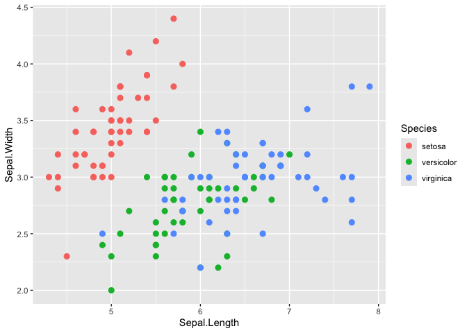
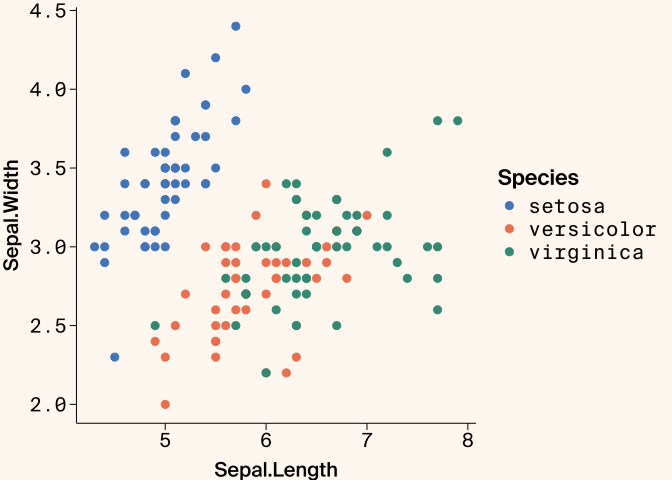
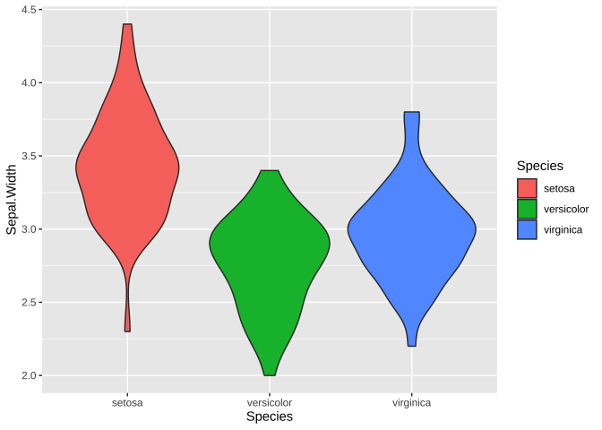
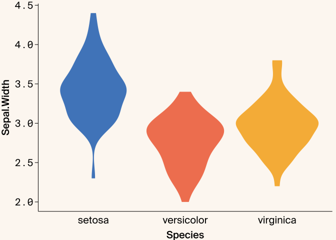
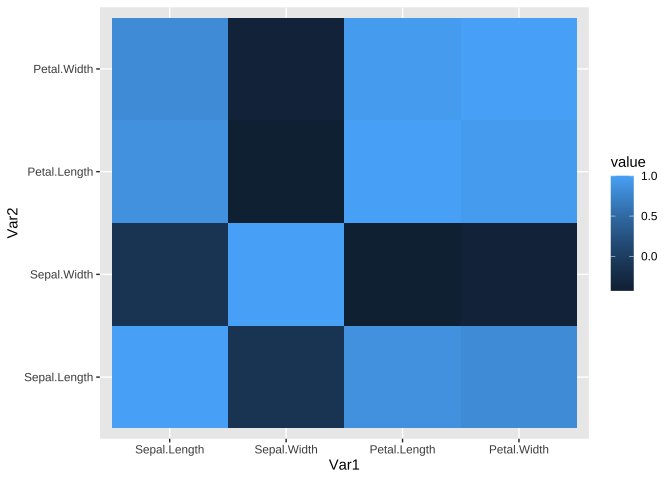
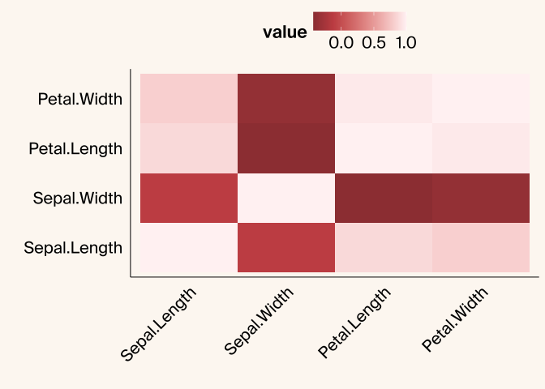

# Before/After Examples

This RMarkdown shows examples of before/after plots to demonstrate how
the arcadiathemeR works to help adhere to our style guidelines.

``` r
library(ggplot2)
library(arcadiathemeR)

# base plot
ggplot(data=iris, aes(x=Sepal.Length, y=Sepal.Width, color=Species)) +
  geom_point(size=2.5)
```

<!-- -->

``` r
# with arcadiathemeR
ggplot(data=iris, aes(x=Sepal.Length, y=Sepal.Width, color=Species)) +
  geom_point(size=2.5) +
  theme_arcadia(x_axis_type = "numerical") +
  scale_color_arcadia("primary")
```

<!-- -->

``` r
ggplot(data=iris, aes(x=Species, y=Sepal.Width, fill=Species)) +
  geom_violin()
```

<!-- -->

``` r
# with arcadiathemeR
ggplot(data=iris, aes(x=Species, y=Sepal.Width, fill=Species)) +
  geom_violin() +
  theme_arcadia(x_axis_type = "categorical") +
  scale_fill_arcadia() +
  theme(legend.position = "none")
```

<!-- -->

``` r
library(reshape2)

# heatmap of correlation matrix from iris dataset
data(iris)
iris_data <- iris[, 1:4]
cor_matrix <- cor(iris_data)
melted_cor_matrix <- (melt(cor_matrix))

ggplot(melted_cor_matrix, aes(x=Var1, y=Var2, fill=value)) +
  geom_tile()
```

<!-- -->

``` r

# with arcadiathemeR
ggplot(melted_cor_matrix, aes(x=Var1, y=Var2, fill=value)) +
  geom_tile() +
  theme_arcadia(x_axis_type = "categorical", y_axis_type = "categorical") +
  gradient_fill_arcadia("reds") + 
  theme(axis.text.x = element_text(angle = 45, hjust = 1),
        legend.position = "top") +
  labs(x = "", y = "")
```

<!-- -->
